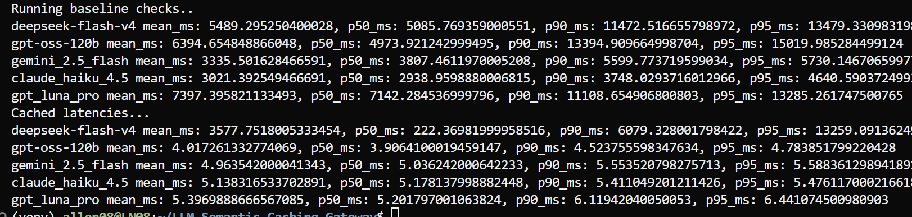

# Latency Benchmarks: LLM Semantic Caching Gateway

Baseline (direct LLM call) vs. cached (gateway) end-to-end latency across five models.

## Setup

| Item | Value |
|---|---|
| Workload | 5 query groups, 3 paraphrases each (15 queries per model) |
| Topics | Entity lookup, economics, biology, geography, code generation |
| Baseline | Every query sent to the model through OpenRouter, no cache |
| Cached | Same queries sent through the gateway (Redis + embedding similarity) |
| Metrics | Mean, p50, p90, p95 end-to-end latency, in milliseconds |
| Provider | OpenRouter (`langchain-openrouter`) |

Percentiles are computed over 15 samples per model, so p90 and p95 sit close to the maximum observed value. Treat them as tail indicators, not stable estimates.

## 1. Baseline latency (no cache)

| Model | Mean (ms) | p50 (ms) | p90 (ms) | p95 (ms) |
|---|---:|---:|---:|---:|
| claude_haiku_4.5 | 3,021.4 | 2,939.0 | 3,748.0 | 4,640.6 |
| gemini_2.5_flash | 3,335.5 | 3,807.5 | 5,599.8 | 5,730.1 |
| deepseek-flash-v4 | 5,489.3 | 5,085.8 | 11,472.5 | 13,479.3 |
| gpt-oss-120b | 6,394.7 | 4,973.9 | 13,394.9 | 15,020.0 |
| gpt_luna_pro | 7,397.4 | 7,142.3 | 11,108.7 | 13,285.3 |

claude_haiku_4.5 is the fastest and the most consistent (p95 is 1.6x its p50), with gemini_2.5_flash close behind (1.5x). gpt-oss-120b and deepseek-flash-v4 show the heaviest tails (p95 is 3.0x and 2.7x their p50).

## 2. Cached latency (gateway)

| Model | Mean (ms) | p50 (ms) | p90 (ms) | p95 (ms) |
|---|---:|---:|---:|---:|
| gpt-oss-120b | 4.02 | 3.91 | 4.52 | 4.78 |
| gemini_2.5_flash | 4.96 | 5.04 | 5.55 | 5.59 |
| claude_haiku_4.5 | 5.14 | 5.18 | 5.41 | 5.48 |
| gpt_luna_pro | 5.40 | 5.20 | 6.12 | 6.44 |
| deepseek-flash-v4 | 3,577.8 | 222.4 | 6,079.3 | 13,259.1 |

The deepseek-flash-v4 row is structurally different from the other four. See "Methodology note" below before comparing rows.

## 3. Latency reduction (baseline to cached)

Reduction = (baseline - cached) / baseline.

| Model | Mean | p50 | p90 | p95 |
|---|---:|---:|---:|---:|
| claude_haiku_4.5 | 99.83% | 99.82% | 99.86% | 99.88% |
| gemini_2.5_flash | 99.85% | 99.87% | 99.90% | 99.90% |
| gpt-oss-120b | 99.94% | 99.92% | 99.97% | 99.97% |
| gpt_luna_pro | 99.93% | 99.93% | 99.94% | 99.95% |
| deepseek-flash-v4 | 34.82% | 95.63% | 47.01% | 1.63% |

## 4. Speedup factor (baseline / cached)

| Model | Mean | p50 |
|---|---:|---:|
| gpt-oss-120b | 1,592x | 1,273x |
| gpt_luna_pro | 1,371x | 1,373x |
| gemini_2.5_flash | 672x | 756x |
| claude_haiku_4.5 | 588x | 568x |
| deepseek-flash-v4 | 1.5x | 22.9x |

# How to Reproduce:

- Configure your `OPENROUTER_API_KEY` and `GROQ_API_KEY` in `.env`
- Run `make evaluate_latency` (or `python -m app.metrics.latency_evaluation`)

- ## You'll get a similar result

- 

## Summary

- For cache hits, p50 latency dropped from 2.9-7.1 seconds to roughly 4-5 ms, a reduction of 99.8% or more on every model (four of five runs).
- The deepseek-flash-v4 run is the only one that exercised the full mixed workload (cold misses plus semantic hits). On that run, p50 fell 95.63% (5,086 ms to 222 ms) and mean fell 34.82% (5,489 ms to 3,578 ms).
- The deepseek-flash-v4 mean and tail are dominated by cache misses. Its cached p95 (13,259 ms) is within 2% of its baseline p95 (13,479 ms), which is expected: a miss pays the full LLM call and the cache cannot help it.
- Absolute savings per hit range from about 2.9 s (claude_haiku_4.5) to about 7.1 s (gpt_luna_pro) at p50, and the saved LLM call also removes its token cost.

## Methodology note

The data indicates that the four runs at about 4-5 ms are not measuring the same thing as the deepseek-flash-v4 run. This pattern reproduced on a second full run:

1. The deepseek-flash-v4 cached pass has a bimodal profile: p50 of 222 ms against a mean of 3,578 ms and a p95 of 13,259 ms. That is consistent with a mix of semantic hits (embedding plus vector lookup, on the order of 100-200 ms) and cold misses at full LLM latency (at least the first query of each group). The exact split is not known, because per-query hit/miss flags are not logged yet.
2. The other four cached passes ran afterwards on a cache that was already populated by that first pass. Every query was an exact repeat of a stored string, which would be served by a lookup that skips embedding similarity. That explains the flat 4-5 ms across all four models, with no tail.

If this reading is correct, then:

- The 4-5 ms figures are best-case exact-match latency, not semantic-match latency.
- The realistic semantic hit latency is closer to the roughly 220 ms p50 seen in the deepseek-flash-v4 pass.
- The cache appears to be keyed independently of the model, so cached results for one model were served in the other models' runs.

To make the cross-model comparison clean, flush Redis before each model's cached pass, and log a per-query hit/miss flag with the similarity score so hit and miss latency can be reported separately. Report exact-match and semantic-match hits as separate rows.

## Other caveats

- n = 15 per model. p90 and p95 are tail indicators only.
- Baseline latency includes provider routing variance and, for reasoning-capable models (deepseek-flash-v4, gpt-oss-120b), hidden reasoning time. Baselines are not a pure measure of serving speed across models. Baseline numbers moved noticeably between runs (for example deepseek-flash-v4 mean 10,681 ms to 5,489 ms), so single-run comparisons across models should be read loosely.
- Earlier runs used a mis-set client timeout (60 ms instead of 60 s) and are excluded. The results above are from the corrected configuration.
- Cached latency excludes the cost of the first (miss) request that populates the cache.