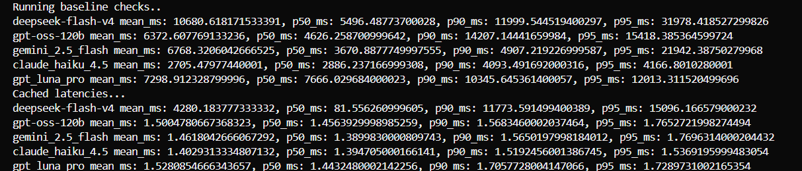

# Latency Benchmarks: LLM Semantic Caching Gateway

Baseline (direct LLM call) vs. cached (gateway) end-to-end latency across five models.

## Setup

| Item | Value |
|---|---|
| Workload | 5 query groups, 3 paraphrases each (15 queries per model) |
| Topics | Entity lookup, economics, biology, geography, code generation |
| Baseline | Every query sent to the model through OpenRouter, no cache |
| Cached | Same queries sent through the gateway (Redis + embedding similarity) |
| Metrics | Mean, p50, p90, p95 end-to-end latency, in milliseconds |
| Provider | OpenRouter (`langchain-openrouter`) |

Percentiles are computed over 15 samples per model, so p90 and p95 sit close to the maximum observed value. Treat them as tail indicators, not stable estimates.

## 1. Baseline latency (no cache)

| Model | Mean (ms) | p50 (ms) | p90 (ms) | p95 (ms) |
|---|---:|---:|---:|---:|
| claude_haiku_4.5 | 2,705.5 | 2,886.2 | 4,093.5 | 4,166.8 |
| gpt-oss-120b | 6,372.6 | 4,626.3 | 14,207.1 | 15,418.4 |
| gemini_2.5_flash | 6,768.3 | 3,670.9 | 4,907.2 | 21,942.4 |
| gpt_luna_pro | 7,298.9 | 7,666.0 | 10,345.6 | 12,013.3 |
| deepseek-flash-v4 | 10,680.6 | 5,496.5 | 11,999.5 | 31,978.4 |

claude_haiku_4.5 is the fastest and by far the most consistent (p95 is 1.5x its p50). deepseek-flash-v4 and gemini_2.5_flash show heavy tails (p95 is 5.8x and 6.0x their p50).

## 2. Cached latency (gateway)

| Model | Mean (ms) | p50 (ms) | p90 (ms) | p95 (ms) |
|---|---:|---:|---:|---:|
| claude_haiku_4.5 | 1.40 | 1.39 | 1.52 | 1.54 |
| gemini_2.5_flash | 1.46 | 1.39 | 1.57 | 1.77 |
| gpt-oss-120b | 1.50 | 1.46 | 1.57 | 1.77 |
| gpt_luna_pro | 1.53 | 1.44 | 1.71 | 1.73 |
| deepseek-flash-v4 | 4,280.2 | 81.6 | 11,773.6 | 15,096.2 |

The deepseek-flash-v4 row is structurally different from the other four. See "Methodology note" below before comparing rows.

## 3. Latency reduction (baseline to cached)

Reduction = (baseline - cached) / baseline.

| Model | Mean | p50 | p90 | p95 |
|---|---:|---:|---:|---:|
| claude_haiku_4.5 | 99.95% | 99.95% | 99.96% | 99.96% |
| gemini_2.5_flash | 99.98% | 99.96% | 99.97% | 99.99% |
| gpt-oss-120b | 99.98% | 99.97% | 99.99% | 99.99% |
| gpt_luna_pro | 99.98% | 99.98% | 99.98% | 99.99% |
| deepseek-flash-v4 | 59.93% | 98.52% | 1.88% | 52.79% |

## 4. Speedup factor (baseline / cached)

| Model | Mean | p50 |
|---|---:|---:|
| gpt_luna_pro | 4,777x | 5,312x |
| gemini_2.5_flash | 4,630x | 2,641x |
| gpt-oss-120b | 4,247x | 3,176x |
| claude_haiku_4.5 | 1,928x | 2,069x |
| deepseek-flash-v4 | 2.5x | 67.4x |

# How to Reproduce:

- Configure your `OPENROUTER_API_KEY` and `GROQ_API_KEY` in `.env`
- Run `python -m app.metrics.latency_evaluation`

- ## You'll get a similar result

- 

## Summary

- For cache hits, p50 latency dropped from 2.9-7.7 seconds to roughly 1.4 ms, a reduction of 99.95% or more on every model (four of five runs).
- The deepseek-flash-v4 run is the only one that exercised the full mixed workload (cold misses plus semantic hits). On that run, p50 fell 98.52% (5,496 ms to 82 ms) and mean fell 59.93% (10,681 ms to 4,280 ms).
- The deepseek-flash-v4 mean and tail are dominated by cache misses. Its cached p90 (11,774 ms) is within 2% of its baseline p90 (11,999 ms), which is expected: a miss pays the full LLM call and the cache cannot help it.
- Absolute savings per hit range from about 2.7 s (claude_haiku_4.5) to about 7.7 s (gpt_luna_pro), and the saved LLM call also removes its token cost.

## Methodology note

The data indicates that the four runs at about 1.4-1.5 ms are not measuring the same thing as the deepseek-flash-v4 run:

1. The deepseek-flash-v4 cached pass has a bimodal profile: p50 of 82 ms with a mean of 4,280 ms and p90 of 11,774 ms. That is consistent with 10 semantic hits (embedding plus vector lookup, about 80 ms) and 5 misses at full LLM latency (the first query of each group), which also reproduces the mean (5 misses at roughly 12-13 s each, divided by 15).
2. The other four cached passes ran afterwards on a cache that was already populated by that first pass. Every query was an exact repeat of a stored string, which would be served by a lookup that skips embedding similarity. That explains the flat 1.4-1.5 ms across all four models, with no tail.

If this reading is correct, then:

- The 1.4 ms figures are best-case exact-match latency, not semantic-match latency.
- The realistic semantic hit latency is the roughly 82 ms seen in the deepseek-flash-v4 pass.
- The cache appears to be keyed independently of the model, so cached results for one model were served in the other models' runs.

To make the cross-model comparison clean, flush Redis before each model's cached pass, and log a per-query hit/miss flag with the similarity score so hit and miss latency can be reported separately. Report exact-match and semantic-match hits as separate rows.

## Other caveats

- n = 15 per model. p90 and p95 are tail indicators only.
- Baseline latency includes provider routing variance and, for reasoning-capable models (deepseek-flash-v4, gpt-oss-120b), hidden reasoning time. Baselines are not a pure measure of serving speed across models.
- Earlier runs used a mis-set client timeout (60 ms instead of 60 s) and are excluded. The results above are from the corrected configuration.
- Cached latency excludes the cost of the first (miss) request that populates the cache.