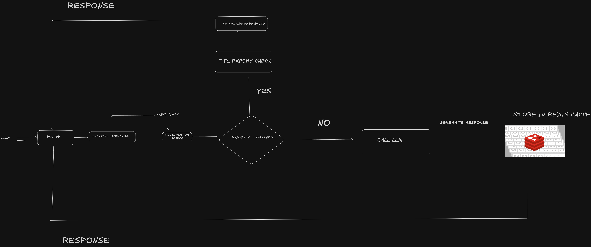

# LLM Semantic Caching Gateway

An **LLM Semantic Caching Gateway** is a middleware layer that sits between client applications and Large Language Models (LLMs) to reduce response latency, lower inference costs, and improve throughput by intelligently reusing previously generated responses.

Unlike traditional key-value caches that require exact string matches, this gateway performs **semantic similarity search** on incoming queries using vector embeddings. If a new query is sufficiently similar to a previously answered query, the cached response is returned immediately, eliminating the need for another expensive LLM inference. Otherwise, the request is forwarded to the LLM, and the newly generated response is stored in the semantic cache for future reuse.

This project demonstrates how semantic caching can significantly improve the performance of LLM-powered applications while maintaining high answer quality. The gateway is designed to be modular and provider-agnostic, making it easy to integrate with different embedding models, vector databases, and LLM providers.

## Features

* Semantic similarity-based caching using vector embeddings
* Redis Stack + RedisVL powered vector search
* FastAPI gateway for handling chat requests
* Automatic cache population on cache misses
* Configurable semantic similarity thresholds
* Performance evaluation framework
* Latency, accuracy, precision, recall, F1-score and cache hit ratio metrics
* Modular architecture supporting different embedding models and LLM providers

## Tech Stack

* **Python 3**
* **FastAPI** – REST API gateway
* **Redis Stack** – Vector database and cache storage
* **RedisVL** – Semantic caching and vector search
* **Ollama** – Local LLM inference
* **DeepSeek-R1:1.5B** – Response generation
* **Nomic Embed Text** – Embedding model
* **Sentence Transformers** – Embedding support
* **Docker Compose** – Redis deployment

## How It Works

1. A client sends a prompt to the FastAPI gateway.
2. The query is converted into a dense vector embedding.
3. RedisVL performs a semantic similarity search against previously cached queries.
4. If the similarity score exceeds the configured threshold, the cached response is returned immediately (**Cache Hit**).
5. Otherwise, the request is forwarded to the LLM (**Cache Miss**).
6. The generated response is stored back in the semantic cache for future requests.

This workflow reduces redundant LLM invocations while preserving response quality through semantic matching instead of exact string matching.

## Evaluation

The semantic cache was evaluated using a benchmark dataset consisting of repeated, paraphrased, and semantically similar queries. Multiple semantic similarity thresholds were tested to analyze the trade-offs between cache hit ratio, precision, recall, latency reduction, and overall cache effectiveness.

The evaluation reports include metrics such as:

* Cache Hit Ratio
* Cache Miss Ratio
* Precision
* Recall
* Accuracy
* F1 Score
* Confusion Matrix
* Average Cache Latency
* Average LLM Latency
* P50 / P95 / P99 Latencies
* Overall Speedup

A detailed comparison of the results obtained across different semantic similarity thresholds is available in **`BENCHMARKS.MD`**.


## Project Structure

| Folder / File                                     | Description                                                                                                                                                           |
| ------------------------------------------------- | --------------------------------------------------------------------------------------------------------------------------------------------------------------------- |
| `app/`                                            | Contains the complete source code for the semantic caching gateway, API, cache implementation, benchmarking framework, and evaluation utilities.                      |
| `app/api/`                                        | FastAPI routes that expose the semantic cache gateway endpoints to client applications.                                                                               |
| `app/benchmark_evaluation/`                       | Contains the benchmarking pipeline, benchmark datasets, and scripts used to evaluate semantic cache performance.                                                      |
| `app/benchmark_evaluation/benchmark.py`           | Executes the benchmark dataset and computes cache performance metrics.                                                                                                |
| `app/benchmark_evaluation/evaluation_dataset.csv` | Benchmark queries with expected cache behavior used for evaluating the semantic cache.                                                                                |
| `app/benchmark_evaluation/faq_dataset.csv`        | Sample FAQ dataset used to populate and test the semantic cache.                                                                                                      |
| `app/cache/`                                      | Core semantic cache implementation using RedisVL and vector similarity search. Responsible for cache lookups, insertions, and semantic matching.                      |
| `app/config/`                                     | Stores application configuration, environment variables, and shared settings.                                                                                         |
| `app/gateway/`                                    | Gateway logic responsible for deciding whether to return a cached response or forward the request to the LLM.                                                         |
| `app/metrics/`                                    | Implements the evaluation framework used to calculate cache hit ratio, precision, recall, F1-score, latency metrics, confusion matrix, and overall cache performance. |
| `app/providers/`                                  | Contains LLM provider implementations. Currently integrates DeepSeek-R1 running locally through Ollama.                                                               |
| `app/schemas/`                                    | Pydantic request and response models used by the FastAPI application.                                                                                                 |
| `app/tests/`                                      | Unit tests covering the cache layer, gateway logic, and API request handling.                                                                                         |
| `app/utils/`                                      | Utility modules and helper functions shared across the project.                                                                                                       |
| `app/main.py`                                     | Entry point of the FastAPI application that initializes the semantic caching gateway.                                                                                 |
| `docker-compose.yml`                              | Starts the Redis Stack instance required for semantic vector search and caching.                                                                                      |
| `README.md`                                       | Project documentation, architecture overview, setup instructions, and usage guide.                                                                                    |
| `BENCHMARKS.MD`                                   | Detailed benchmark results across multiple semantic similarity thresholds, including latency analysis and cache performance comparisons.                              |
| `requirements.txt`                                | Python dependencies required to run the project.                                                                                                                      |
| `venv/`                                           | Local Python virtual environment (not required after cloning the repository).                                                                                         |

---

# Running the Project

## 1. Clone the repository

```bash
git clone <repository-url>
cd llm-semantic-cache-gateway
```

## 2. Create and activate a virtual environment

```bash
python -m venv venv
```

Linux / macOS

```bash
source venv/bin/activate
```

Windows

```powershell
venv\Scripts\activate
```

## 3. Install dependencies

```bash
pip install -r requirements.txt
```

## 4. Start Redis Stack

```bash
docker compose up -d
```

## 5. Start the Ollama server

```bash
ollama serve
```

Ensure the required models are installed:

```bash
ollama pull deepseek-r1:1.5b
ollama pull nomic-embed-text
```

## 6. Run the Semantic Caching Gateway

```bash
python -m app.main
```

The API will be available at:

```
http://localhost:8000
```

Swagger documentation:

```
http://localhost:8000/docs
```

---

# Running the Benchmark Evaluation

After the gateway is running, execute the benchmark suite:

```bash
python -m app.benchmark_evaluation.benchmark
```

The benchmark automatically:

* Loads the benchmark dataset
* Executes semantic cache lookups
* Measures cache hits and misses
* Computes precision, recall, accuracy, and F1-score
* Calculates cache latency and LLM latency
* Generates confusion matrix statistics
* Reports cache speedup over direct LLM inference

A detailed comparison of different semantic similarity thresholds and their impact on cache performance is provided in **`BENCHMARKS.MD`**.


# ARCHITECTURE
