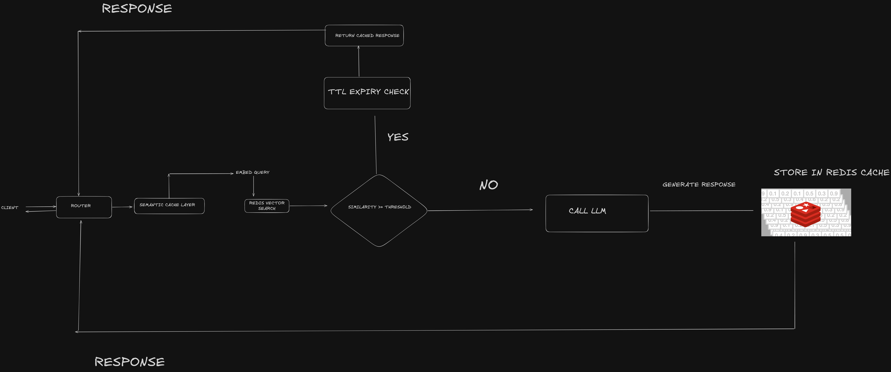

# LLM Semantic Caching Gateway


A drop-in gateway that sits between your application and your LLM providers and **answers repeated questions from a semantic cache instead of paying for another inference call**.

LLM-backed products see the same questions over and over, phrased differently: *"What is Redis?"*, *"Explain Redis to me"*, *"what's redis used for"*. A normal key-value cache treats each of those as a miss, so every one of them costs money and takes seconds. This gateway embeds each incoming prompt, searches a vector index of previously answered prompts, and returns the stored answer when a close-enough match exists. Only genuinely new questions reach the model, and their answers are stored for next time.

The result is lower latency, lower cost, and higher throughput, with the similarity threshold as an explicit, measurable knob for trading hit rate against answer correctness. This repository includes the evaluation harness used to measure that trade-off, not just the cache.

## Results at a glance

<!-- Fill these in from LATENCY_BENCHMARKS.MD and THRESHOLD_BENCHMARKS.MD -->

| Metric | Value |
| --- | --- |
| Median latency, cache hit vs. direct LLM call | `X ms` vs. `Y ms` |
| Overhead added on a cache miss (embedding + lookup) | `Z ms` |
| Recommended similarity threshold | `T` |
| Precision / recall at that threshold | `P%` / `R%` |

Full methodology and numbers: [`LATENCY_BENCHMARKS.MD`](./LATENCY_BENCHMARKS.MD) and [`THRESHOLD_BENCHMARKS.MD`](./THRESHOLD_BENCHMARKS.MD).

## Features

* Semantic similarity caching on top of **Redis Stack** and **RedisVL** vector search
* **FastAPI** gateway with a single chat-completions endpoint
* **Five LLMs behind one interface**, selectable per request
* Automatic cache population on misses
* Configurable similarity threshold, benchmarked at 0.3, 0.5, 0.75 and 0.9
* Evaluation framework: hit/miss ratio, precision, recall, accuracy, F1, confusion matrix, P50/P95/P99 latency, speedup over baseline
* Dockerized: the whole stack starts with one command
* Automated tests with GitHub Actions CI

## Supported models

Pass one of these as `llm_model` in the request body.

| `llm_model` | Provider |
| --- | --- |
| `deepseek-flash-v4` | OpenRouter |
| `gemini_2.5_flash` | OpenRouter |
| `claude_haiku_4.5` | OpenRouter |
| `gpt_luna_pro` | OpenRouter |
| `gpt-oss-120b` | Groq |

## Tech stack

* **Python 3.12**, **FastAPI**, **Pydantic**
* **Redis Stack** and **RedisVL** for vector search and cache storage
* **Sentence Transformers** with `redis/langcache-embed-v1` (Hugging Face) for embeddings
* **LangChain** provider integrations (`langchain-openrouter`, `langchain-groq`)
* **Docker Compose** for deployment
* **pytest** and **GitHub Actions** for testing and CI

## How it works

1. A client sends a prompt to the gateway.
2. The prompt is converted to a dense vector embedding.
3. RedisVL searches the index of previously cached prompts for the nearest neighbor.
4. If the distance is within the configured threshold, the stored response is returned immediately (**cache hit**).
5. Otherwise the request is routed to the selected LLM (**cache miss**).
6. The new response is written to the cache for future requests.

## Architecture



## Project structure

```
.
├── .github/workflows/ci.yml     # CI: tests against a Redis service container
├── app/
│   ├── api/                     # FastAPI routes
│   ├── benchmark_evaluation/
│   │   ├── benchmark.py
│   │   ├── evaluation_dataset.csv
│   │   └── faq_dataset.csv
│   ├── cache/                   # Semantic cache (RedisVL)
│   ├── config/                  # Settings and model names
│   ├── gateway/                 # Hit-or-forward decision logic
│   ├── metrics/                 # Evaluation metrics
│   ├── providers/               # LLM providers and model router
│   ├── schemas/                 # Pydantic request/response models
│   ├── utils/                   # Shared helpers
│   └── main.py                  # Application entry point
├── tests/
│   ├── test_cache.py
│   ├── test_chat_request.py
│   └── test_gateway.py
├── Diagram.png
├── Dockerfile
├── docker-compose.yml
├── image.png
├── LATENCY_BENCHMARKS.MD
├── Makefile
├── observations.txt
├── pytest.ini
├── README.MD
├── requirements.txt
└── THRESHOLD_BENCHMARKS.MD
```

### What each part does

| Path | Purpose |
| --- | --- |
| `app/api/` | FastAPI routes that expose the gateway to clients. |
| `app/cache/` | The semantic cache: embedding, vector lookup, insertion, and threshold matching on RedisVL. |
| `app/gateway/` | Decides whether to serve a cached response or forward to an LLM, then writes new answers back. |
| `app/providers/` | Provider clients and the `Router` that maps `llm_model` names to OpenRouter and Groq models. |
| `app/schemas/` | Request and response models shared across the API. |
| `app/config/` | Configuration and model identifiers. |
| `app/metrics/` | Computes hit ratio, precision, recall, F1, confusion matrix, and latency percentiles. |
| `app/benchmark_evaluation/` | Benchmark runner and datasets used to evaluate cache quality across thresholds. |
| `app/utils/` | Small helpers used across modules. |
| `app/main.py` | Initializes the FastAPI app. |
| `tests/` | Tests for the cache layer, gateway logic, and API route. |
| `.github/workflows/ci.yml` | Runs the test suite on every push and pull request. |
| `THRESHOLD_BENCHMARKS.MD` | Cache quality at similarity thresholds 0.3, 0.5, 0.75 and 0.9. |
| `LATENCY_BENCHMARKS.MD` | Our cache vs. baseline (direct LLM) latency comparison. |
| `observations.txt` | Working notes from experiments. |
| `Dockerfile`, `docker-compose.yml` | Container image for the gateway and the Redis Stack service. |
| `Makefile` | Shortcuts: `make run`, `make test`, `make evaluate`. |
| `pytest.ini` | Test discovery and import-path configuration. |
| `Diagram.png`, `image.png` | Architecture diagram and latency chart. |

## Getting started

### Prerequisites

* Docker and Docker Compose
* Python 3.12 (only for running without Docker)
* API keys for **OpenRouter**, **Groq**, and **Hugging Face** (see below)

### 1. Clone the repository

```bash
git clone https://github.com/AllenGeorge08/LLM-Semantic-Caching-Gateway.git
cd LLM-Semantic-Caching-Gateway
```

### 2. Configure environment variables

```bash
cp .env.example .env
```

Then fill in your keys:

```
OPENROUTER_API_KEY=   # DeepSeek, Gemini, Claude Haiku and GPT Luna Pro (via OpenRouter)
GROQ_API_KEY=         # gpt-oss-120b (via Groq)
HF_TOKEN=             # downloads the sentence-transformers embedding model from Hugging Face
```

The embedding model is [`redis/langcache-embed-v1`](https://huggingface.co/redis/langcache-embed-v1).

### 3. Run it

**With Docker (recommended):** starts Redis Stack and the gateway together.

```bash
docker compose up --build
```

**Without Docker for the app:** start Redis, then run the gateway locally.

```bash
python3 -m venv venv
source venv/bin/activate          # Windows: venv\Scripts\activate
pip install -r requirements.txt

docker compose up -d redis        # Redis Stack only
make run
```

The API is available at `http://localhost:8000`, with interactive Swagger docs at `http://localhost:8000/docs`.

### 4. Try it

```bash
curl -X POST http://localhost:8000/api/v1/chat/completions \
  -H "Content-Type: application/json" \
  -d '{"llm_model": "gpt-oss-120b", "prompt": "What is a database and why is it used?"}'
```

Example response:

```json
{
  "response": "...",
  "cache_hit": false,
  "similarity_score": null,
  "cache_latency": 73.1,
  "llm_latency": 2669.2
}
```

Send a rephrased version of the same question (*"Why do we use databases?"*) and `cache_hit` becomes `true`, with the LLM latency gone.

## Testing

```bash
make test
```

Tests run against a live Redis instance. CI (GitHub Actions) starts one as a service container.

## Benchmarks

```bash
make evaluate
```

The evaluation runs a labeled set of repeated, paraphrased, and unrelated queries and reports:

* Cache hit and miss ratio
* Precision, recall, accuracy, and F1
* Confusion matrix
* Average cache latency vs. average LLM latency
* P50 / P95 / P99 latency
* Overall speedup

Two reports are included:

* **[`THRESHOLD_BENCHMARKS.MD`](./THRESHOLD_BENCHMARKS.MD)**: how hit rate, precision, and recall change at thresholds 0.3, 0.5, 0.75 and 0.9. A looser threshold serves more requests from cache but risks returning an answer to a different question; a stricter one is safer but saves less.
* **[`LATENCY_BENCHMARKS.MD`](./LATENCY_BENCHMARKS.MD)**: our cache vs. the baseline (direct LLM call), per model.

### Latency comparison

